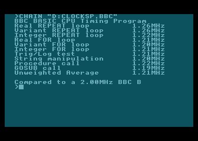
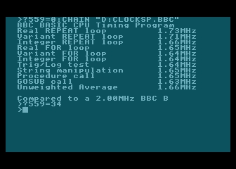

# BBC BASIC for the Atari XL/XE

This is a port of BBC BASIC 3.10 for the Atari XL/XE computers.
3.10 was the last version that ran on an NMOS 6502.
Later versions required a CMOS 65C02, and won't run on an unmodified Atari.

The BBC BASIC dialect is described in the
[BBC Microcomputer User Guide](http://regregex.bbcmicro.net/BPlusUserGuide-1.07.pdf).
One of the most attractive features is the builtin assembler.
It's described in the aformentioned user guide. More information and tips & tricks can be found in
[Creative Assembler](https://acorn.huininga.nl/pub/docs/manuals/Acornsoft/Creative%20Assembler%20-%20How%20To%20Write%20Arcade%20Games.pdf).

## System Requirements

BBC BASIC 3.10 for the Atari XL/XE runs on any XL/XE compatible machine with at least 64kB of RAM, and a floppy drive.
If you're familiar with Turbo Basic 1.5, this works more or less the same.
A small portion of the BBC BASIC interpreter resides in main RAM, but most of the interpreter runs from the RAM _under_ the OS ROM.
Also in main RAM is a translation layer that implements most of the MOS (the BBC OS) calls needed by the interpreter.
See the **memory map** below for details.

## Screen Editor

To enter BASIC programs, the usual Atari E: (Editor) device driver is used for keyboard input and screen output.
So unlike the BBC, you don't need a separate editor to comfortably edit you programs.
You can use the cursor keys to move around, make changes, and press RETURN to commit the changes.
It correctly distinguishes between logical and physical lines, just like Atari BASIC, unless you use ```WIDTH``` to change the terminal width to something other than 0.
**Don't do that**, as the editor won't know where a logical line starts or ends anymore.
If you want different left or right margins, poke the appropriate Atari OS memory locations (LMARGN and RMARGN).

## Differences

The Atari is not an Acorn computer, so in order to turn BBC BASIC into a useful BASIC for the Atari, some compromises had to be made.
Instead of doing a poor BBC emulation, some of the commands work differenty than they would on the BBC in order to make them more useful on the Atari.

* The BREAK key interrupts like ESCape on the BBC. Pressing the RESET key does a coldstart, but you can recover your listing by typing ```OLD```.

* ```SOUND``` works like Atari BASIC, i.e. ```SOUND voice, pitch, distortion, volume```. If your Atari is equiped with a second Pokey, you can add 8 to the voice parameter to play sounds on the right channel.

* ```ENVELOPE``` does nothing.

* You can use ```ADVAL(255)``` to check if there's a pending keypress. All other ADC values are ignored. To read joysticks, peek at the shadow registers in RAM (e.g. ```DIR=?&0278```).

* OPENUP, EXT# and PTR# do not work because there's no byte accurate way to do fseek/ftell with Atari DOS 2.5.

#### Graphics Modes

It's not possible to accurately emulate the BBC graphics modes. The resolutions and the available colors are too different, so instead BBC BASIC for the Atari uses the standard OS graphics modes and its coordinate system. (0,0) is at the top-left corner, and the maximum resolution is 320x192 (MODE 8).

* ```MODE``` works like Atari BASIC's ```GRAPHICS```. Supported modes are 0-15. Add 16 to disable the text window at the bottom. 

* ```POINT``` works like ```LOCATE```. For example ```A = POINT(42,42)``` returns the color of the pixel at position (42,42) in A.

* ```PLOT action, x, y``` supports action 4 (MOVE), 5 (DRAW), and 69 (PLOT POINT). All other actions are ignored.

* To plot a single point, use ```PLOT 69,x,y```.

* ```MOVE x,y``` is a shortcut for ```PLOT 4,x,y```. It moves the graphics cursor to location (x,y) (but does not plot a point).

* ```DRAW x,y``` shortcut for ```PLOT 5,x,y```. It draws a line from the current position to (x,y) in the current drawing color.

* ```COLOR num``` selects the drawing color.

* ```GCOL``` acts like ```SETCOLOR``` in Atari BASIC, but takes two arguments. The color number 0-4, and what value to set it to (&00-&ff). For example, setting the color of playfield 2 to red is ```GCOL 2,&34```.

## MOS Vectors

Just like on the BBC, you can make MOS calls directly from inline assembly. The vectors are located in RAM page &2F instead of the usual page &FF on a BBC. Note that the order and the LSBs are identical.

```
OSFIND = &2FCE 
OSBPUT = &2FD4 
OSBGET = &2FD7 
OSARGS = &2FDA 
OSFILE = &2FDD 
OSRDCH = &2FE0 
OSASCI = &2FE3 
OSNEWL = &2FE7 
OSWRCH = &2FEE 
OSWORD = &2FF1 
OSBYTE = &2FF4 
OSCLI  = &2FF7 
```

## Atari Control Characters

All Atari control characters (```CHR$0``` to ```CHR$31```) can be printed, _except_ for ```CHR$13``` (&0D) which is the end-of-line character (CR, carriage return).
It was not possible to change this to the Atari equivalent 155 (&9b) because that would clash with tknCOS (the internal token value for the COS function call).
Internally BBC BASIC sometimes scans a tokenized line and stops when it encounters the EOL character (&0D). This would fail if EOL and tknCOS are
the same value. If you really need the 'overscore' character, you can either poke &4D directly into the screen memory, or bypass OSWRCH and write to CIO channel #0 directly.

## Typing special characters

BBC BASIC for the Atari uses the BBC font. Sometimes you need to type the ~ (tilde) if you want to print a hexadecimal
value, or you might want the '}' character somewhere in a string.
To type them, you need to press ESC first to have the actual character show because originally on the Atari they had a special meaning
(e.g. clear screen) and BBC BASIC's keyboard input is done through the standard E:ditor device driver.
So ```ESC SHIFT-CLEAR``` is '}', and ```ESC BACKSPACE``` is '~'.

## Memory Map

Here's the memory layout when BBC BASIC is running:

| Range | RAM | ROM | Other |
| --- | --- | --- | --- |
| &FFFA - &FFFF | CPU Vectors | | |
| &D800 - &FFF9 | BBC BASIC | Atari OS | |
| &D000 - &D7FF | | | Hardware Registers |
| &C000 - &CFFF | BBC BASIC | Atari OS | |
| HIMEM - &CFFF | Screen Memory | | |
| | | | |
| PAGE - HIMEM | **Free** (ca. 32kB in MODE 0) | | |
| | | | |
| &3800 - &3BFF | BBC BASIC Workspace | | |
| &3000 - &37FF | BBC BASIC | | |
| &2FB9 - &2FFF | MOS Vectors | | |
| &2400 - &2FB8 | MOS Translation Layer | | |
| &2000 - &23FF | BBC Font | | |
| | | | |
| &0700 - &1FFF | Atari DOS | | |
| &0600 - &06FF | **Free** (page six) | | |
| &0200 - &05FF | Atari OS Variables | | |
| &0100 - &01FF | 6502 Stack | | |
| | | | |
| &00FD - &00FF | MOS Variables | | |
| &00D9 - &00FC | **Free** | | |
| &00D0 - &00D8 | Translation Layer Variables | | |
| &0080 - &00CF | BBC BASIC Variables | | |
| &0000 - &007F | Atari OS Variables | | |

## Speed

Among the sample programs is ```CLOCKSP.BBC```. Here are the results compared to a BBC Micro Model B at 2.0MHz.

With ANTIC DMA enabled:  


And with ANTIC DMA disabled:  


Which, considering there are still cycles stolen by the RAM refresh circuitry, is pretty close to 1.8MHz.
During normal operation, with the screen on, it runs at around 60% of the speed of a BBC Model B.

Note that on an NTSC machine, the timings are off. The BBC BASIC ```TIME``` variable counts 100Hz ticks on a PAL machine, but 120Hz ticks on an NTSC machine.
It's similar to how an RTCLOK jiffy in Atari BASIC is 1/50th of a second or 1/60th of a second, depending on where you run it.
Be sure to take this into account if you use the TIME variable to meassure the speed of your code.
